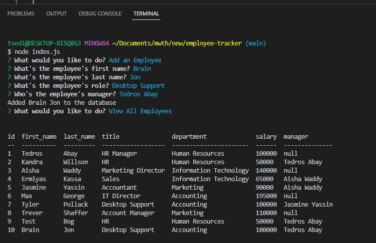

Employee-tracker

A command-line application to manage a company's employee database, using Node.js, Inquirer, and MySQL.

Github : https://github.com/Tsedi28/employee-tracker
Walkthrough video : 

Description
A command-line application to manage a company's employee database, using Node.js, Inquirer, and MySQL.

User Story
- AS A business owner
- I WANT to be able to view and manage the departments, roles, and employees in my company
- SO THAT I can organize and plan my business

Usage
Application will allow user to view all departments.
Application will allow user to view all roles.
Application will allow user to view all employees.
Application will allow user to add a department.
Application will allow user to add a role.
Application will allow user to add an employee.
Application will allow user to update an employee role.

Screenshots:

    

Technologies Use
Node.js

NPM

MySQL

Inquirer.js

Node MySQL 2

console.table

Contributor:

Tsedenia Bogale ©2022 All Rights Reserved.